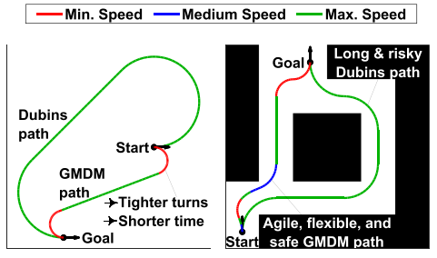

# GMDM: Generalized Multispeed Dubins Motion Model C++ Library

This code implements GMDM which extends the Dubins model by considering multiple speeds. While the Dubins model produces time-optimal paths under a constant-speed constraint, these paths could be suboptimal if this constraint is relaxed to include multiple speeds. This is because a constant speed results in a large minimum turning radius, thus producing paths with longer maneuvers and larger travel times. In contrast, multispeed relaxation allows for slower speed sharp turns, thus producing more direct paths with shorter maneuvers and smaller travel times. Furthermore, the inability of the Dubins model to reduce speed could result in fast maneuvers near obstacles, thus producing paths with high collision risks. In this regard, GMDM provides the motion planners the ability to jointly optimize time and risk by allowing the change of speed along the path. GMDM is built upon the six Dubins path types considering the change of speed on path segments. It is theoretically established that GMDM provides full reachability of the configuration space for any speed selections. Furthermore, it is shown that the Dubins model is a specific case of GMDM for constant speeds. The solutions of GMDM are analytical and suitable for real-time applications. Published results show that in obstacle-free environments, GMDM produces near time-optimal paths with significantly lower travel times than the Dubins model while having similar computation times. In obstacle-rich environments, GMDM produces time-risk optimized paths with substantially lower collision risks.

 

